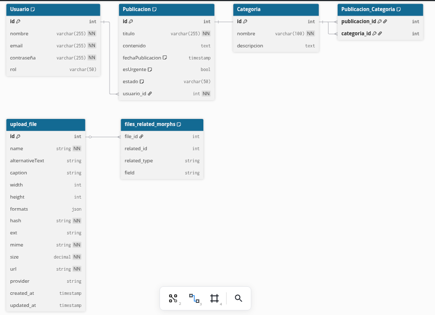

# **Diseño Técnico del Proyecto FSI (v1.0)**

Este documento consolida el diseño de la base de datos (DBML) y el contrato de la API (Endpoints) para el backend de Strapi, basado en los entregables y refinamientos del equipo.

## **1\. Schema de Datos Lógico (Alineado con Strapi)**

Este DBML describe las colecciones y sus relaciones tal como se implementarán en Strapi, utilizando sus plugins nativos.

```dbml
//// ----------------------------------------
//// DBML Lógico (Abstraído para Strapi)
//// ----------------------------------------

// NOTA: La tabla 'Usuario' se gestiona con el plugin
// 'Users & Permissions' de Strapi (tabla 'up_users').

Table Categoria {
  id int [pk, increment]
  nombre varchar(100) [unique, not null]
  descripcion text
  // Relacionado vía 'Publicacion_Categoria_Links'
}

Table Publicacion {
  id int [pk, increment]
  titulo varchar(255) [not null]

  // --- Campos Nativos de Strapi ---
  // 'contenido' (text) -> Reemplazado por una Zona Dinámica (Dynamic Zone)
  // 'estado' (string) -> Reemplazado por 'publishedAt' (nativo de Strapi)
  // 'imagen_url' (string) -> Reemplazado por 'portada' (relación Media)

  fechaPublicacion timestamp [default: `now()`] // 'createdAt' (nativo de Strapi)
  esUrgente bool [default: false]

  // --- Relaciones ---
  // Relación 1:N con el plugin de Usuarios
  usuario_id int [not null, ref: > up_users.id]

  // Relación 1:N con el plugin de Media
  // (Strapi gestiona esto vía 'files_related_morphs')
  // Se añade un campo 'portada' de tipo 'Media (single)'.

  // 'publishedAt' es añadido automáticamente por Strapi
  // para gestionar Borrador vs Publicado.
  publishedAt timestamp [null]
}

// Tabla intermedia N:M (Publicacion <-> Categoria)
// Strapi crea esta tabla como 'publicacions_categorias_links'
Table Publicacion_Categoria_Links {
  publicacion_id int [pk, ref: > Publicacion.id]
  categoria_id int [pk, ref: > Categoria.id]
}

//// ----------------------------------------
//// Tablas Nativas de Strapi (Referencia)
//// ----------------------------------------

// Tabla del Plugin de Usuarios
Table up_users {
  id int [pk]
  username string
  email string
  // ...otros campos...
}

// Tabla del Plugin de Media
Table upload_file {
  id int [pk]
  name string
  url string
  // ...otros campos...
}

// Tabla de unión para Zonas Dinámicas (Contenido)
// Ejemplo si se crea un Componente "Parrafo"
Table components_contenido_parrafos {
  id int [pk]
  texto text
}

// Tabla de unión principal para la Zona Dinámica
Table publicacions_components {
  entity_id int [pk] // -> Publicacion.id
  component_id int [pk] // -> components_contenido_parrafos.id
  component_type string // 'components_contenido_parrafos'
  field string // 'contenido'
  "order" int
}

```

### Diagrama ERD



## **2\. Contrato de API (Endpoints y Estructuras)**

Definición de las rutas de la API, sus roles de acceso y los ejemplos de respuesta JSON.

### **Endpoints Principales**

| Método   | Endpoint                          | Descripción                                 | Rol/Acceso            |
| :------- | :-------------------------------- | :------------------------------------------ | :-------------------- |
| **POST** | /api/auth/local                   | Autenticación de administrador (Login).     | Público (retorna JWT) |
| **GET**  | /api/users/me                     | Obtiene datos del usuario autenticado.      | Admin / Editor        |
| **GET**  | /api/publicaciones                | Lista todas las publicaciones (publicadas). | Público               |
| **GET**  | /api/publicaciones/:id            | Muestra detalle de una publicación.         | Público               |
| **GET**  | /api/publicaciones?filters\[...\] | Filtra publicaciones (ej. por categoría).   | Público               |
| **POST** | /api/publicaciones                | Crea nueva publicación.                     | Admin / Editor        |
| **PUT**  | /api/publicaciones/:id            | Edita una publicación existente.            | Admin / Editor        |

###

### **Ejemplo de Respuesta: Detalle de Publicación**

GET /api/publicaciones/:id?populate=portada,categorias,contenido

Este _endpoint_ debe poblar (populate) todas las relaciones clave: la imagen de portada, la lista de categorías (N:M) y los componentes de la Zona Dinámica (contenido).

```json
{
  "data": {
    "id": 1,
    "attributes": {
      "titulo": "Evento de Bienvenida Universitaria",
      "fechaPublicacion": "2025-10-22T14:30:00Z",
      "esUrgente": true,
      "createdAt": "...",
      "updatedAt": "...",
      "publishedAt": "2025-10-22T14:30:00Z",

      // --- Relación Media (1:1) ---
      "portada": {
        "data": {
          "id": 10,
          "attributes": {
            "name": "bienvenida.jpg",
            "url": "/uploads/bienvenida.jpg"
          }
        }
      },

      // --- Relación Categorías (N:M) ---
      "categorias": {
        "data": [
          {
            "id": 1,
            "attributes": {
              "nombre": "Evento"
            }
          },
          {
            "id": 5,
            "attributes": {
              "nombre": "Académico"
            }
          }
        ]
      },

      // --- Zona Dinámica (Contenido) ---
      "contenido": [
        {
          "__component": "contenido.parrafo",
          "id": 1,
          "texto": "Se realizará el próximo lunes..."
        },
        {
          "__component": "contenido.parrafo",
          "id": 2,
          "texto": "Habrá música y comida."
        }
      ]
    }
  },
  "meta": {}
}
```
